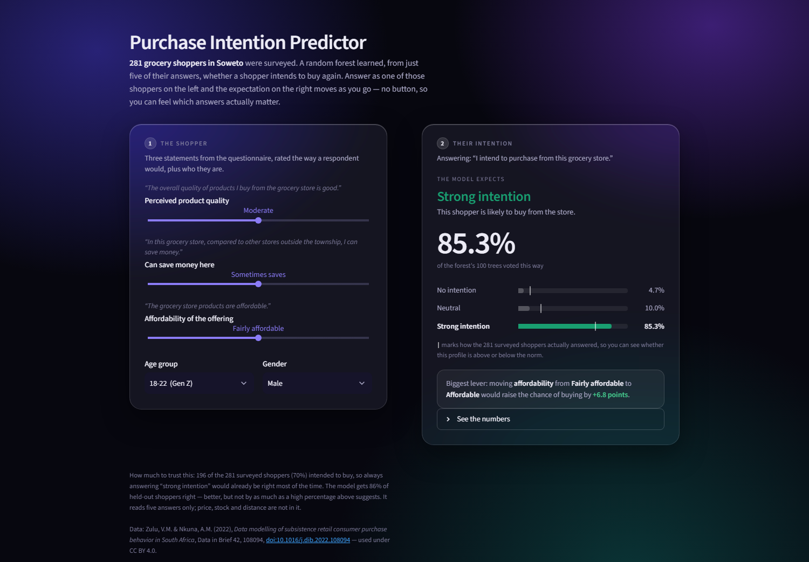

# Purchase Intention Predictor

An interactive Streamlit app that predicts whether a shopper intends to buy from their
local grocery store in Soweto, from five answers on a published consumer survey — and,
more importantly, tries to explain itself while it does it.



## What it does

A Random Forest, trained on a published survey of 281 subsistence-retail shoppers in
Soweto, reads five answers and estimates purchase intention as one of three outcomes: **no intention**,
**neutral**, or **strong intention**.

The interface is built so a visitor understands what is happening without reading this
file:

- **The real questionnaire statements sit above each control.** You are not setting a
  variable called `PV3`; you are answering *"In this grocery store, compared to other
  stores outside the township, I can save money."*
- **It updates live.** There is no submit button, so moving an answer immediately moves
  the outcome, and you can feel which answers actually carry weight.
- **Every bar is marked with the survey's own base rate**, so a probability is read
  against how the 281 real shoppers answered rather than against nothing.
- **It names the biggest lever** — the single answer change that would most raise the
  chance of buying, restricted to the three attitudinal answers, since a store cannot
  change a shopper's age.
- **It states where it is weak**, in place, at the moment that matters.

## Honesty about the model

Worth being upfront, because the headline number flatters:

| | |
| --- | --- |
| Hold-out accuracy | **86%** |
| Always guessing "strong intention" | **70%** |
| Recall on "no intention" | **0.50** (28 rows out of 281) |

196 of the 281 surveyed shoppers intended to buy, so a model that always said "yes"
would already be right most of the time. 86% is a real improvement on that, but a
smaller one than it looks. The "no intention" class is the model's weakest — it catches
about half of them — and the app says so on screen whenever it predicts that outcome.

The model reads five answers only. Price, stock, distance and competition are not in it.

## Inputs

| Control | Feature | Questionnaire statement |
| --- | --- | --- |
| Perceived product quality | `PPQ1` | "The overall quality of products I buy from the grocery store is good" |
| Can save money here | `PV3` | "In this grocery store, compared to other stores outside the township, I can save money" |
| Affordability of the offering | `PV2` | "The grocery store products are affordable" |
| Age group | `Age` | demographic, 1–5 |
| Gender | `Gender` | demographic, 1–3 |

The target is `PI1` — *"I intend to purchase from this grocery store."*

## Running it locally

```
python -m venv .venv
.venv/Scripts/activate        # Windows (PowerShell or Git Bash)
source .venv/bin/activate     # macOS / Linux
pip install -r requirements.txt
streamlit run app.py
```

It opens on http://localhost:8501. Needs Python 3.11+ (tested on 3.11 and 3.14).
`random_forest_model.pkl` must sit beside `app.py`.

Also runs in GitHub Codespaces as-is — the devcontainer installs the requirements and
starts the app on port 8501 automatically.

## Retraining

```
python train.py                 # overwrites random_forest_model.pkl
python train.py -o /tmp/rf.pkl  # writes elsewhere
```

`train.py` reconstructs the pipeline from the original analysis notebooks, with two
deliberate differences, both documented in the script: it trains on the five features
the app collects rather than all 37 columns, and it fixes `random_state` so runs are
reproducible. The original notebook set none, so the *first* committed model could not
be reproduced exactly by anything; the current one can.

### How the target is derived

`PI1` (1–5) collapses to three classes: 1 and 2 become `0` (no intention), 4 and 5
become `1` (strong intention), 3 becomes `2` (neutral). `PI2`–`PI4` are dropped, as
they measure the same construct as the target.

### Where the five features came from

They were selected by cross-category correlation in the original analysis, which wrote
`minimum_dataset = df[['PI1','PPQ1','PV3','PV2','Age','Gender']]`. Age and gender were
kept deliberately despite failing the correlation threshold, "so as to better
understand possible demographic trends".

## How it is built

| | |
| --- | --- |
| App | Streamlit, single `app.py` |
| Model | scikit-learn `RandomForestClassifier`, 100 trees, 5 features, 3 classes |
| Charting | none — the outcome bars are plain HTML/CSS |
| Theme | `.streamlit/config.toml` plus a frosted-glass CSS layer |

Two notes for anyone editing the interface:

- The cards are targeted by the `st-key-*` class Streamlit emits for a **keyed**
  container (`st.container(border=True, key=...)`). The generic layout-wrapper testid
  is shared with plain column wrappers, so styling that instead also glasses the
  nested Age/Gender columns.
- `SURVEY_COUNTS` in `app.py` hardcodes the target distribution `{0: 28, 1: 196,
  2: 57}` so the app can draw base-rate marks without reading the spreadsheet at
  runtime. Retraining on different data means updating it.

Custom CSS against Streamlit internals is version-fragile, which is why `requirements.txt`
pins exact versions. `random_forest_model.pkl` is pickled with scikit-learn 1.9.0 and
the app warns at startup if a different version is installed.

## Data source

The survey data is published open data, not collected for this project. It is the
companion dataset to:

> Zulu, V.M. & Nkuna, A.M. (2022). *Data modelling of subsistence retail consumer
> purchase behavior in South Africa*. **Data in Brief**, 42, 108094.
> [doi:10.1016/j.dib.2022.108094](https://doi.org/10.1016/j.dib.2022.108094)

Dataset: *Subsistence Retail Consumer Data*, Mendeley Data,
[doi:10.17632/5z37z85jck.1](https://doi.org/10.17632/5z37z85jck.1) — **CC BY 4.0**,
so it is free to reuse with attribution.

281 usable responses (94% of 300 approached) were collected by self-administered
questionnaire from grocery shoppers in Soweto, on a five-point Likert scale. The
original study used PLS-SEM; this project is an independent reuse of the same data
for supervised classification.

The column prefixes are the study's constructs:

| Prefix | Construct | | Prefix | Construct |
| --- | --- | --- | --- | --- |
| `E` | Empathy | | `PPQ` | Perceived Product Quality |
| `C` | Convenience | | `CT` | Customer Trust |
| `PS` | Price Sensitivity | | `PV` | Perceived Value |
| `PE` | Physical Environment | | `PI` | Purchase Intention |

## Licence

Code is MIT licensed — see [LICENSE](LICENSE). The licence covers the code only, not
the survey data.

## Credits

Built by Luyanda Mdhluli as a university project in 2024, and tidied up since. The
original repository lives under the [ufs-za](https://github.com/ufs-za) organisation.

The data is the work of Valencia Melissa Zulu and Andriaan Mpho Nkuna (School of
Business Sciences, University of the Witwatersrand), used here under CC BY 4.0.
